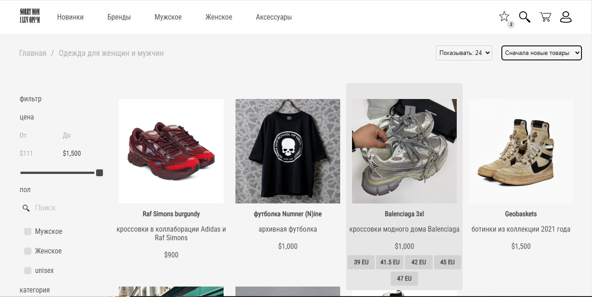

# Интернет магазин одежды

интернет магазин одежды и аксессуаров с широким функционалом и постояной поддержкой



## Инструкция по запуску

### Backend (FastAPI)

1. Установить зависимости:

```
pip install -r requirements.txt
```

2. Запустить приложение:

```
uvicorn main:app --reload
```

Приложение будет доступно по адресу [http://localhost:8000](http://localhost:8000)

### Frontend (Angular)

1. Установить зависимости:

```
npm install
```

2. Запустить приложение:
   
```
ng serve
```

Приложение будет доступно по адресу [http://localhost:4200](http://localhost:4200)

## Технологии

- FastAPI
- Angular